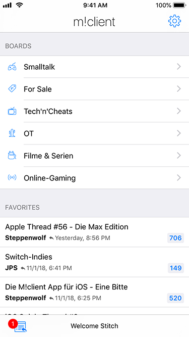
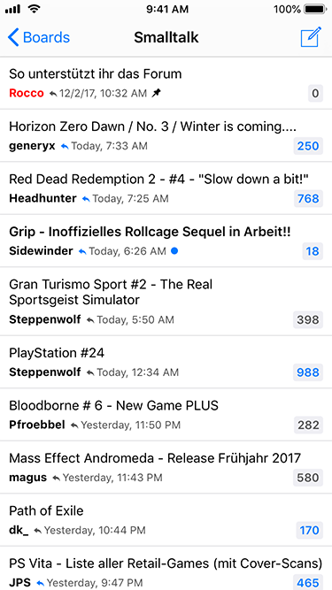
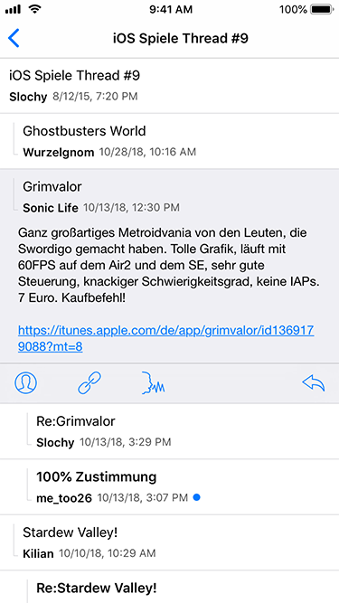
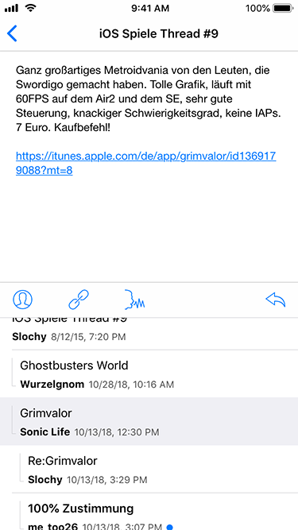
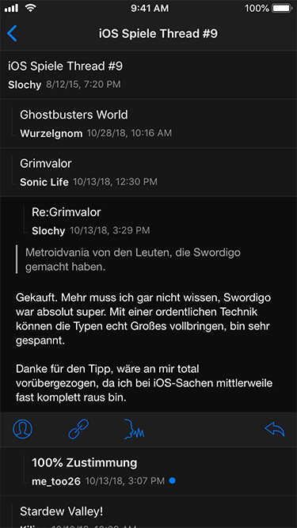

m!client
========

iOS client for the [Man!ac Forum](https://www.maniac-forum.de/forum/pxmboard.php), the oldest german speaking videogame community.

# Screenshots

## Board selection / Favorites

## Thread selection

## Thread View

## Classic Thread View

## Dark Mode

# License

[MIT License](https://en.wikipedia.org/wiki/MIT_License)
